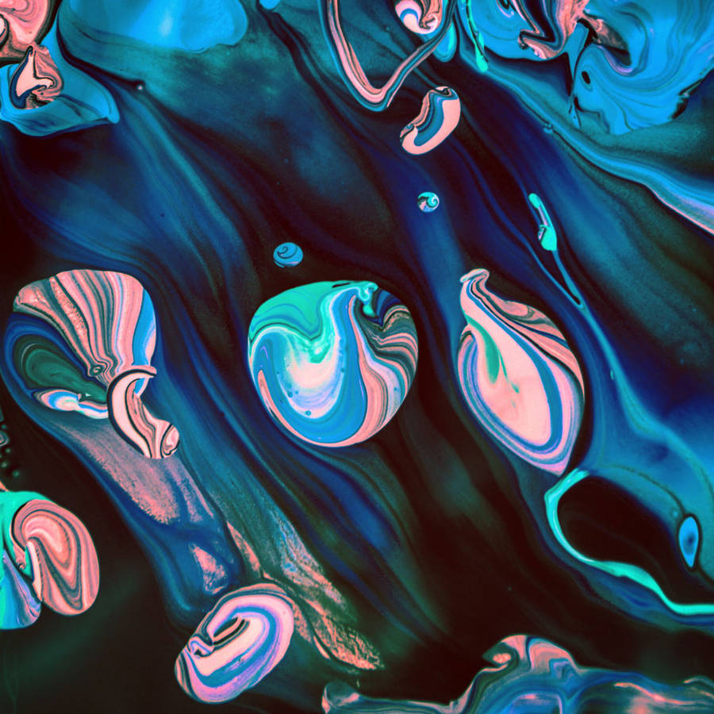

# audio

Two years of sketches with a microphone in them, and a handful that made sound instead. Volume in, pictures out: waves that grew when the room got loud, polygons that tumbled when someone laughed near the laptop, a black sun that drew its own orbit one dot at a time. Then a small piano that hummed arpeggios to itself.

Read the story: [Code 13: The sketches that listened](https://www.shashrvacai.com/blog/code-34-the-sketches-that-listened).

The folder is copied as it was, one subfolder per sketch. `basic_*` were the first experiments (autumn 2017), `shelved_*` were the ones I had already given up on. Listeners use `processing.sound` (Amplitude + AudioIn); the singers (`PianoPlayer*`, `keyboard_keyboard*`, `sineInstrument`, `ADSRExample`) use Minim. Audio files and data folders are not included.

Highlights: `Drumstiks` (a flock that scatters on a hit), `Tumbling_Polygons`, `Ollisions`, `waves_2`, `blacksun`, `sketch_171107dStrings`, `squigly_circle`, `Rae` (the last one, October 2019), `PianoPlayerApergios` (random arpeggios wandering between keys).

## Gallery

One picture per folder, click through to the code.

<a href="ADSRExample"><code>ADSRExample</code> (no picture)</a>
<a href="Agents69FlocksAudio"><code>Agents69FlocksAudio</code> (no picture)</a>
<a href="Chains"><code>Chains</code> (no picture)</a>
<a href="Cloth_Chains"><code>Cloth_Chains</code> (no picture)</a>
<a href="Dragging_chainsWAudio"><code>Dragging_chainsWAudio</code> (no picture)</a>

<a href="PianoPlayerApergios"><code>PianoPlayerApergios</code> (no picture)</a>
<a href="PianoPlayerApergios_wChords_"><code>PianoPlayerApergios_wChords_</code> (no picture)</a>
<a href="PianoPlayerWChords"><code>PianoPlayerWChords</code> (no picture)</a>
<a href="PixelFLowRandomWalker"><code>PixelFLowRandomWalker</code> (no picture)</a>

<a href="ReactionDiffusionwAUdio"><code>ReactionDiffusionwAUdio</code> (no picture)</a>

<a href="YOYO"><code>YOYO</code> (no picture)</a>
<a href="basic_Gray"><code>basic_Gray</code> (no picture)</a>
<a href="basic_perlin_feildaudioOnlyBlur"><code>basic_perlin_feildaudioOnlyBlur</code> (no picture)</a>
<a href="basic_sketch_170912a_perlin_grassw_AudioIn"><code>basic_sketch_170912a_perlin_grassw_AudioIn</code> (no picture)</a>

<a href="basic_sketch_170925b_soundtest"><code>basic_sketch_170925b_soundtest</code> (no picture)</a>
<a href="basic_sketch_170926c_Audi_3dfor_spout"><code>basic_sketch_170926c_Audi_3dfor_spout</code> (no picture)</a>
<a href="basic_sketch_171006bdreamCatcher"><code>basic_sketch_171006bdreamCatcher</code> (no picture)</a>

<a href="basic_sketch_171011arecursion"><code>basic_sketch_171011arecursion</code> (no picture)</a>
<a href="basic_sketch_171018bSnookered"><code>basic_sketch_171018bSnookered</code> (no picture)</a>
<a href="basic_sketch_171020aOscilating_pendulum"><code>basic_sketch_171020aOscilating_pendulum</code> (no picture)</a>
<a href="basic_sketch_171020amultiple_Pendulums"><code>basic_sketch_171020amultiple_Pendulums</code> (no picture)</a>
<a href="basic_sketch_171022amultPendulumAudioIn"><code>basic_sketch_171022amultPendulumAudioIn</code> (no picture)</a>
<a href="basic_sketch_171023bmultiple_springs"><code>basic_sketch_171023bmultiple_springs</code> (no picture)</a>
<a href="basic_sketch_171023bmultiple_springs2Array"><code>basic_sketch_171023bmultiple_springs2Array</code> (no picture)</a>
<a href="basic_sketch_171107DreamCatcher"><code>basic_sketch_171107DreamCatcher</code> (no picture)</a>
<a href="basic_sketch_171109bWavePatterns"><code>basic_sketch_171109bWavePatterns</code> (no picture)</a>
<a href="basic_sketch_171109eTriangleA"><code>basic_sketch_171109eTriangleA</code> (no picture)</a>

<a href="dawn_Chorus"><code>dawn_Chorus</code> (no picture)</a>
<a href="keyboard_keyboard"><code>keyboard_keyboard</code> (no picture)</a>
<a href="keyboard_keyboard_v_pitch_"><code>keyboard_keyboard_v_pitch_</code> (no picture)</a>
<a href="perlin_feildaudio"><code>perlin_feildaudio</code> (no picture)</a>
<a href="randomPianoPlayer"><code>randomPianoPlayer</code> (no picture)</a>
<a href="shelved_circularPlexus"><code>shelved_circularPlexus</code> (no picture)</a>
<a href="shelved_flowy_waves"><code>shelved_flowy_waves</code> (no picture)</a>
<a href="shelved_sketch_170823b"><code>shelved_sketch_170823b</code> (no picture)</a>
<a href="shelved_sketch_170912a_perlin_grass"><code>shelved_sketch_170912a_perlin_grass</code> (no picture)</a>
<a href="shelved_sketch_171018a_Basic_angular_velocity"><code>shelved_sketch_171018a_Basic_angular_velocity</code> (no picture)</a>
<a href="sineInstrument"><code>sineInstrument</code> (no picture)</a>

<a href="sketch_170926c_Audi3D"><code>sketch_170926c_Audi3D</code> (no picture)</a>
<a href="sketch_171107aNoiseWave"><code>sketch_171107aNoiseWave</code> (no picture)</a>
<a href="sketch_171107bGlobeWave"><code>sketch_171107bGlobeWave</code> (no picture)</a>

<a href="star_feild"><code>star_feild</code> (no picture)</a>

