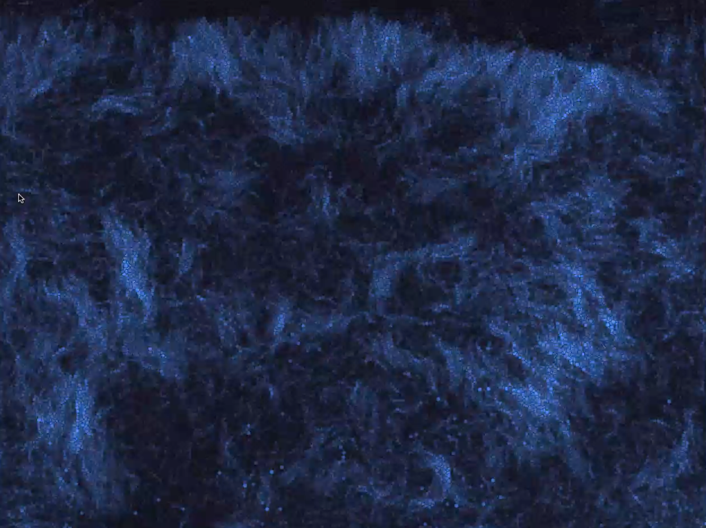

# camera

Everything that pointed a lens at a body. A Kinect for a year and a half, from the first depth-image test in August 2017 to smoke rising off shoulders in November 2018, then the webcam because a webcam fits in a pocket. `kinect_*` is the 05-kinect folder, `video_*` is 04-Video, `artbridges_*` is the Kinect installation that never went public, `unicorn_*` and `withlove_*` were made for one person each.

Read the story: [Code 35: The sketches that looked back](https://www.shashrvacai.com/blog/code-35-the-sketches-that-looked-back).

Highlights: `kinect_sketch_170801a` (the first one), `kinect_hatch_texture` to `_texture5` (the depth image hatched like an etching, January 2018), `kinect_Box2D_kinect` (bricks you can catch), `kinect_Following_boxes` (particles find the middle of you), `kinect_emittor`, `kinect_smokeEmittor_`, `kinect_CompleteBodySmoke` (smoke off the body, the last one listening to a mic too), `kinect_Kinect_flow_field` (the body as wind, also in flow-field), `video_WebCam_seperate` (orbs that flee movement), `video_B_Wthreshold`, `video_ExplodeLive` (every pixel a cell that bursts), `video_pixelFluidTintshift`, `video_SlitScan`, `withlove_framedifferencing_webcam`.

Libraries: Open Kinect for Processing (Kinect v2), processing.video, SimpleOpenNI (ArtBridges skeleton tracking), PixelFlow, Box2D, processing.sound. The ArtBridges Max patches are in `_max_patches`. Movies, depth-frame data and anything over 3 MB are not included.

## Gallery

One picture per folder, click through to the code.

<a href="artbridges_DreamCather"><code>artbridges_DreamCather</code> (no picture)</a>
<a href="artbridges_DreamCather_7f80"><code>artbridges_DreamCather_7f80</code> (no picture)</a>
<a href="artbridges_Geometric_flowers"><code>artbridges_Geometric_flowers</code> (no picture)</a>
<a href="artbridges_Mtest1"><code>artbridges_Mtest1</code> (no picture)</a>
<a href="artbridges_Spot_OSc"><code>artbridges_Spot_OSc</code> (no picture)</a>
<a href="artbridges_YOYO"><code>artbridges_YOYO</code> (no picture)</a>
<a href="artbridges_YOYOSquare"><code>artbridges_YOYOSquare</code> (no picture)</a>
<a href="artbridges_YOYOSquare_5faa"><code>artbridges_YOYOSquare_5faa</code> (no picture)</a>
<a href="artbridges_YOYO_2c90"><code>artbridges_YOYO_2c90</code> (no picture)</a>
<a href="artbridges_YOYO_spout_test"><code>artbridges_YOYO_spout_test</code> (no picture)</a>
<a href="artbridges_YOYOsmoke"><code>artbridges_YOYOsmoke</code> (no picture)</a>
<a href="artbridges_YOYOsmoke_03ae"><code>artbridges_YOYOsmoke_03ae</code> (no picture)</a>

<a href="kinect_ComExample03_Physics"><code>kinect_ComExample03_Physics</code> (no picture)</a>

<a href="kinect_Invert__Kinect_flow_field"><code>kinect_Invert__Kinect_flow_field</code> (no picture)</a>
<a href="kinect_K_Oil"><code>kinect_K_Oil</code> (no picture)</a>
<a href="kinect_KinectDepth_PGCanvas"><code>kinect_KinectDepth_PGCanvas</code> (no picture)</a>
<a href="kinect_Kinect_flow_field"><code>kinect_Kinect_flow_field</code> (no picture)</a>

<a href="kinect_ReactioDifussion"><code>kinect_ReactioDifussion</code> (no picture)</a>

<a href="kinect_eye_repellwKinect"><code>kinect_eye_repellwKinect</code> (no picture)</a>
<a href="kinect_fluidK"><code>kinect_fluidK</code> (no picture)</a>

<a href="kinect_kinect_physics"><code>kinect_kinect_physics</code> (no picture)</a>

<a href="kinect_video_Depth_PG_graphics"><code>kinect_video_Depth_PG_graphics</code> (no picture)</a>
<a href="kinect_video_Depth_PG_graphics_b137"><code>kinect_video_Depth_PG_graphics_b137</code> (no picture)</a>
<a href="kinect_video_Depth_test"><code>kinect_video_Depth_test</code> (no picture)</a>
<a href="unicorn_Cloth_uni"><code>unicorn_Cloth_uni</code> (no picture)</a>
<a href="unicorn_framedifferencing_webcam_uni"><code>unicorn_framedifferencing_webcam_uni</code> (no picture)</a>

<a href="video_Cloth_vid"><code>video_Cloth_vid</code> (no picture)</a>

<a href="video_ExplodeVideo"><code>video_ExplodeVideo</code> (no picture)</a>
<a href="video_MovieLiquidTest"><code>video_MovieLiquidTest</code> (no picture)</a>
<a href="video_OpticalFlowVideo"><code>video_OpticalFlowVideo</code> (no picture)</a>
<a href="video_OpticalFlowVideoSB"><code>video_OpticalFlowVideoSB</code> (no picture)</a>
<a href="video_SlitScan"><code>video_SlitScan</code> (no picture)</a>
<a href="video_SlitScanTifa"><code>video_SlitScanTifa</code> (no picture)</a>
<a href="video_WebCamParticles"><code>video_WebCamParticles</code> (no picture)</a>
<a href="video_WebCamParticles_B_W"><code>video_WebCamParticles_B_W</code> (no picture)</a>

<a href="video_aa_ImageBrightness"><code>video_aa_ImageBrightness</code> (no picture)</a>
<a href="video_aa_ImageBrightness_and_backgrondSubstraction"><code>video_aa_ImageBrightness_and_backgrondSubstraction</code> (no picture)</a>
<a href="video_aa_OpticalFlow"><code>video_aa_OpticalFlow</code> (no picture)</a>

<a href="video_openCv_contours"><code>video_openCv_contours</code> (no picture)</a>

<a href="video_pixelSort_Sep_B_W"><code>video_pixelSort_Sep_B_W</code> (no picture)</a>
<a href="video_sketch_170927a_Video_one"><code>video_sketch_170927a_Video_one</code> (no picture)</a>
<a href="video_slitgrid_one"><code>video_slitgrid_one</code> (no picture)</a>
<a href="video_spout_audio"><code>video_spout_audio</code> (no picture)</a>
<a href="video_webcam_sosritng_test"><code>video_webcam_sosritng_test</code> (no picture)</a>
<a href="withlove_Cloth_invid"><code>withlove_Cloth_invid</code> (no picture)</a>
<a href="withlove_framedifferencing_webcam"><code>withlove_framedifferencing_webcam</code> (no picture)</a>

