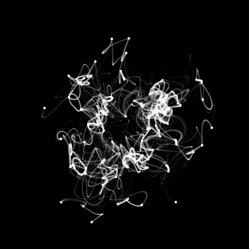
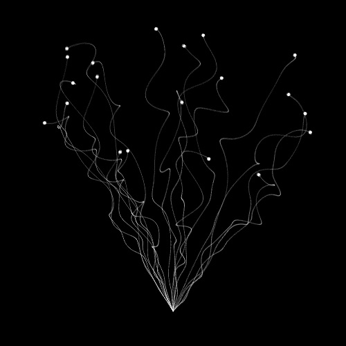
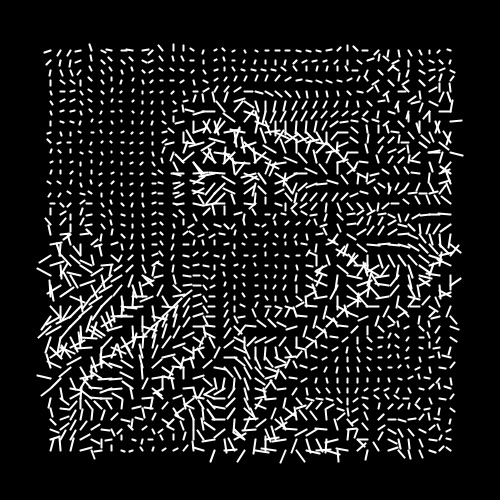
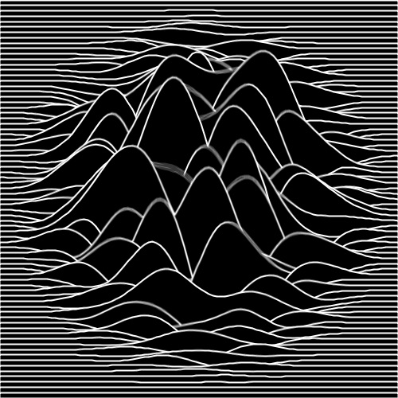
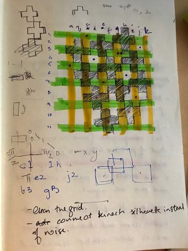
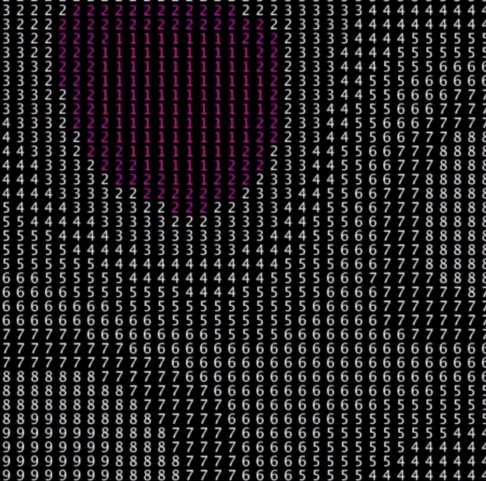

# noise-kit

One 2,000-line file, `Osn.pde`, copied into seventeen sketches between 2018 and 2019. It is Kurt Spencer's OpenSimplexNoise, public domain, which I pasted in whenever `noise()` looked too Processing. I never understood it well enough to rewrite it, so it travelled whole.

Read the story: [Code 32: The spare tyre](https://www.shashrvacai.com/blog/code-32-the-file-i-never-read).

| Folder | Date | Where | What it is |
|---|---|---|---|
| undated_simplex_noise_pixels | 2018 | practice | the Shiffman pixel-noise example with OSN swapped in. The first paste |
| 2018-04-11_tenprint_noise, _pixellate, _audio | 11 Apr 2018 | practice | 10PRINT diagonals bent by noise, keys q/w/e/s/a for spacing and weight; a pixellated variant; an audio-in variant |
| 2018-04_ninth_node_tenprint_noise (+ Max copy) | Apr 2018 | Ninth Node | the show copy, plus the copy that lived next to the Max patch |
| 2020-06_algorave_tenprint_noise_pixellate | Jun 2020 | Algorave (Caider, remote) | same file again, two years on |
| 2018-04-11_barcode_noise | Apr 2018 | practice | stacked bands of noise on a seamless loop, EXCLUSION circle on top. Etienne Jacob's looping template |
| 2018_noisy_boxes_loop, _flower_box_loop, _circular_webs_loop, _popping_head_noise_loop | 2018 | practice | four GIF-loop sketches on the same template (`ease()`, `numFrames`, `recording`) |
| 2019-04-02_tuning_plus | Apr 2019 | practice | plus-sign grid tuned by noise |
| 2019-05-03_algorave_number_osn, 2019_number_osn | May 2019 | Algorave wall | a grid of digits reading the field, /n1 and /n2 from Max over OSC |
| 2019-06-17_osn_concentric_circle | Jun 2019 | Cyberia prep | concentric rings deformed by noise (also in the circles lineage) |

Frame exports (`fr###.png`) are not included. Libraries: oscP5, processing.sound. OpenSimplexNoise by Kurt Spencer (public domain), looping template after Etienne Jacob / Dave Whyte.

## Gallery

One picture per folder, click through to the code.

<a href="2019_number_osn"><code>2019_number_osn</code> (no picture)</a>

<a href="undated_simplex_noise_pixels"><code>undated_simplex_noise_pixels</code> (no picture)</a>

