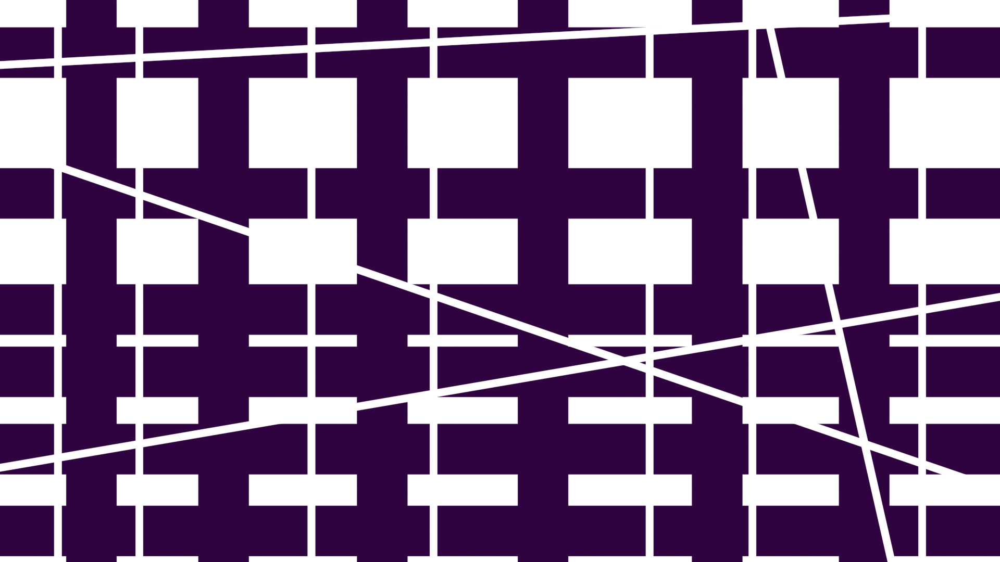

# physics

Springs, pendulums, chains, cloth, bricks, dam breaks. The thread that never found a show of its own but sneaked into all of them. Two springs from The Nature of Code in autumn 2017, then a June 2018 week of Box2D and PixelFlow soft bodies for the Squish show (where three of my drawings were the colour maps the particles wore), a liquid wave machine and toxiclibs chains that autumn, and LiquidFun for Cyberia the next summer.

Read the story: [Code 36: Things that fall](https://www.shashrvacai.com/blog/code-36-things-that-fall).

| Folder | Date | Where | What it is |
|---|---|---|---|
| 2017-10-20_multiple_pendulums, 2017-10-23_multiple_springs (+ array) | Oct 2017 | practice | Nature of Code chapter 3 |
| 2018-02-06_tumbling_polygons_algorave_copy | Feb 2018 | Algorave wall | polygons tumbling off a ledge (the original lives in audio) |
| 2018-06-14_pixelflow_53_*, _54, _56, _boxes_audio_box2d | Jun 2018 | practice | one week of PixelFlow soft bodies and Box2D boxes that jump to the mic |
| 2018-06_squish_* | Jun 2018 | Squish | the show file (audio in, star, tunnel, vehicles, drawings as colour maps, keys m , . to switch), the dam break, the tumbler, and the test folder |
| 2018-09-30_wave_machine_liquidfun, _dragging_chains_toxiclibs | Sep 2018 | practice | a liquid wave machine; chains you can drag, with a random walker tugging them |
| 2019-04-09_underwater_plants_pixelflow_kinect | Apr 2019 | practice | plants that sway around a Kinect body |
| 2019-06-18_cyberia_liquidfun, 2019-06_cyberia_squish_copy, _wall_squish_copy, 2019_tifa_wall_liquidfun_dam_break | Jun 2019 | Cyberia, TIFA wall | the Squish file and the dam break again, a year on |
| undated_cloth_pixelflow, _fabric_springs, _verlet_sticky_threads, _fluid*, _sat_collisions, _noise_surface_toxiclibs_audio | 2018 to 2019 | practice | cloth three ways, fluids two ways, separating-axis collisions |

Libraries: Box2D for Processing, LiquidFun (Thomas Diewald's port), PixelFlow, toxiclibs, processing.sound, Open Kinect. Data over 3 MB not included.

## Gallery

One picture per folder, click through to the code.

<a href="2017-10-20_multiple_pendulums"><code>2017-10-20_multiple_pendulums</code> (no picture)</a>
<a href="2017-10-23_multiple_springs"><code>2017-10-23_multiple_springs</code> (no picture)</a>
<a href="2017-10-23_multiple_springs_array"><code>2017-10-23_multiple_springs_array</code> (no picture)</a>

<a href="2018-06_squish_box2d_tumbler"><code>2018-06_squish_box2d_tumbler</code> (no picture)</a>

<a href="2018-06_squish_door_twist"><code>2018-06_squish_door_twist</code> (no picture)</a>

<a href="2018-06_squish_liquidfun_dam_break"><code>2018-06_squish_liquidfun_dam_break</code> (no picture)</a>

<a href="2018-06_squish_noc_boxes"><code>2018-06_squish_noc_boxes</code> (no picture)</a>

<a href="2018-06_squish_shifting_doors"><code>2018-06_squish_shifting_doors</code> (no picture)</a>

<a href="2018-06_squish_tunnel_2"><code>2018-06_squish_tunnel_2</code> (no picture)</a>

<a href="2018-09-30_wave_machine_liquidfun"><code>2018-09-30_wave_machine_liquidfun</code> (no picture)</a>

<a href="2019_tifa_wall_liquidfun_dam_break"><code>2019_tifa_wall_liquidfun_dam_break</code> (no picture)</a>
<a href="undated_cloth_pixelflow"><code>undated_cloth_pixelflow</code> (no picture)</a>
<a href="undated_fabric_springs"><code>undated_fabric_springs</code> (no picture)</a>
<a href="undated_fluid"><code>undated_fluid</code> (no picture)</a>
<a href="undated_fluid_custom_particles"><code>undated_fluid_custom_particles</code> (no picture)</a>
<a href="undated_fluid_navier_solver"><code>undated_fluid_navier_solver</code> (no picture)</a>
<a href="undated_noise_surface_toxiclibs_audio"><code>undated_noise_surface_toxiclibs_audio</code> (no picture)</a>
<a href="undated_sat_collisions"><code>undated_sat_collisions</code> (no picture)</a>
<a href="undated_verlet_sticky_threads"><code>undated_verlet_sticky_threads</code> (no picture)</a>

