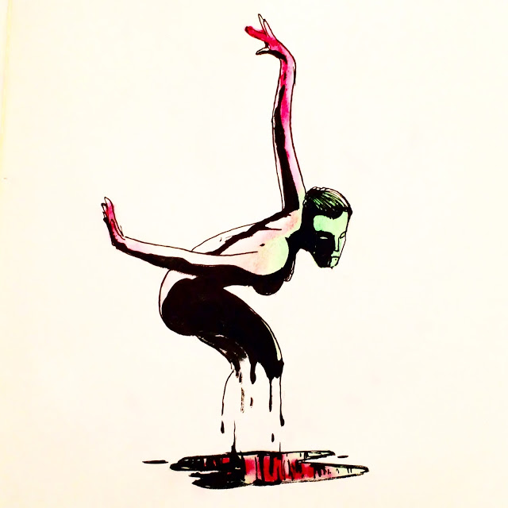
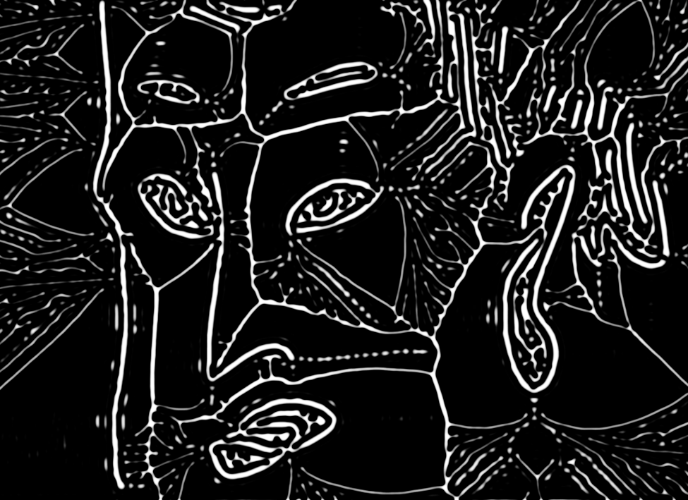

# shows

The rigs. Not sketches, show files: one file per gig with a state machine, section comments, a microphone, and whatever the room needed bolted on (OSC in from Max, Syphon or Spout out to the projector). `17` is the December 2017 evenings (Obsidian Tapes, Sonic Psych, TIXER), `jazz_fest_*` is the 2018 cue file and its test folder, `CyberiaClosing_*` the 2019 festival closing patch, `Monsoon_*` and `TifaWall` the TIFA pieces, `Mark_Simple` the sketch set up on a friend's laptop for Group Electronics, `wall_Algorave_*` the 2020 remote algorave, `marismo` and `test2` two small p5 loops. `max_*` holds the Max patches that drove the Processing sketches over OSC, and the copies of sketches that lived next to them.

Read the story: [Code 38: The show file](https://www.shashrvacai.com/blog/code-38-the-show-file).

Libraries: processing.sound, oscP5, Syphon, Spout, Open Kinect, PixelFlow, LiquidFun. Max 7/8 patches (`.maxpat`). Footage and audio not included.

## Gallery

One picture per folder, click through to the code.

<a href="17_Obsedian_Tapes_OBSIDIANtapes"><code>17_Obsedian_Tapes_OBSIDIANtapes</code> (no picture)</a>
<a href="17_Obsedian_Tapes_done_old_ArchiTech"><code>17_Obsedian_Tapes_done_old_ArchiTech</code> (no picture)</a>
<a href="17_Obsedian_Tapes_done_old_EchoSound2"><code>17_Obsedian_Tapes_done_old_EchoSound2</code> (no picture)</a>
<a href="17_Obsedian_Tapes_done_old_OBSIDIANtapes"><code>17_Obsedian_Tapes_done_old_OBSIDIANtapes</code> (no picture)</a>
<a href="17_Obsedian_Tapes_done_old_Simple_PI"><code>17_Obsedian_Tapes_done_old_Simple_PI</code> (no picture)</a>
<a href="17_Obsedian_Tapes_done_old_moora"><code>17_Obsedian_Tapes_done_old_moora</code> (no picture)</a>
<a href="17_Obsedian_Tapes_starFeild"><code>17_Obsedian_Tapes_starFeild</code> (no picture)</a>
<a href="17_sketch_171103aTIXER"><code>17_sketch_171103aTIXER</code> (no picture)</a>
<a href="17_sketch_171103aTIXER_sketch_171020Tixer1"><code>17_sketch_171103aTIXER_sketch_171020Tixer1</code> (no picture)</a>
<a href="17_sketch_171103aTIXER_sketch_171102aTixer2"><code>17_sketch_171103aTIXER_sketch_171102aTixer2</code> (no picture)</a>
<a href="17_sketch_171108bSonicPsych_2_sketch_171108bSonicPsych"><code>17_sketch_171108bSonicPsych_2_sketch_171108bSonicPsych</code> (no picture)</a>
<a href="CyberiaClosing_00_Show_Patch"><code>CyberiaClosing_00_Show_Patch</code> (no picture)</a>
<a href="CyberiaClosing_00_Show_Patch_CyberiaClosing"><code>CyberiaClosing_00_Show_Patch_CyberiaClosing</code> (no picture)</a>

<a href="CyberiaClosing_just_flock"><code>CyberiaClosing_just_flock</code> (no picture)</a>

<a href="Mark_Simple"><code>Mark_Simple</code> (no picture)</a>
<a href="Monsoon_MonsoonGrid"><code>Monsoon_MonsoonGrid</code> (no picture)</a>

<a href="TifaWall"><code>TifaWall</code> (no picture)</a>
<a href="jazz_fest_sketch_01JF"><code>jazz_fest_sketch_01JF</code> (no picture)</a>
<a href="jazz_fest_sketch_02JF"><code>jazz_fest_sketch_02JF</code> (no picture)</a>
<a href="jazz_fest_sketch_03JF"><code>jazz_fest_sketch_03JF</code> (no picture)</a>
<a href="jazz_fest_test_Bubble_FHSE"><code>jazz_fest_test_Bubble_FHSE</code> (no picture)</a>

<a href="jazz_fest_test_FLocks_For_FHSE"><code>jazz_fest_test_FLocks_For_FHSE</code> (no picture)</a>
<a href="jazz_fest_test_perlin_feildaudio"><code>jazz_fest_test_perlin_feildaudio</code> (no picture)</a>

<a href="jazz_fest_test_sketch_171107cWaveAudio"><code>jazz_fest_test_sketch_171107cWaveAudio</code> (no picture)</a>
<a href="jazz_fest_test_sketch_171107dStrings"><code>jazz_fest_test_sketch_171107dStrings</code> (no picture)</a>
<a href="jazz_fest_test_sketch_171218a"><code>jazz_fest_test_sketch_171218a</code> (no picture)</a>
<a href="jazz_fest_test_starFeild"><code>jazz_fest_test_starFeild</code> (no picture)</a>

<a href="marismo"><code>marismo</code> (no picture)</a>
<a href="max_DreamCather"><code>max_DreamCather</code> (no picture)</a>
<a href="max_JazzFest_MAx"><code>max_JazzFest_MAx</code> (no picture)</a>
<a href="max_JazzFest_Spot_OSc"><code>max_JazzFest_Spot_OSc</code> (no picture)</a>
<a href="max_JazzFest_Yoyo"><code>max_JazzFest_Yoyo</code> (no picture)</a>
<a href="max_JazzFest_Yoyo_YOYO"><code>max_JazzFest_Yoyo_YOYO</code> (no picture)</a>
<a href="max_JazzFest_Yoyo_YOYO_spout_test"><code>max_JazzFest_Yoyo_YOYO_spout_test</code> (no picture)</a>

<a href="max_JazzFest_ninth_Node_Ripple_with_mask"><code>max_JazzFest_ninth_Node_Ripple_with_mask</code> (no picture)</a>
<a href="max_JazzFest_ninth_Node_shifting_shadows"><code>max_JazzFest_ninth_Node_shifting_shadows</code> (no picture)</a>
<a href="max_JazzFest_processing_sketch_01JF"><code>max_JazzFest_processing_sketch_01JF</code> (no picture)</a>
<a href="max_JazzFest_processing_sketch_02JF"><code>max_JazzFest_processing_sketch_02JF</code> (no picture)</a>
<a href="max_Max"><code>max_Max</code> (no picture)</a>
<a href="max_Max_Projects"><code>max_Max_Projects</code> (no picture)</a>
<a href="max_Mtest1"><code>max_Mtest1</code> (no picture)</a>
<a href="max_YOYO"><code>max_YOYO</code> (no picture)</a>
<a href="max_maxPatch"><code>max_maxPatch</code> (no picture)</a>
<a href="max_max_test"><code>max_max_test</code> (no picture)</a>
<a href="max_oscConnection"><code>max_oscConnection</code> (no picture)</a>
<a href="max_oscConnection_sketch_181111c"><code>max_oscConnection_sketch_181111c</code> (no picture)</a>

<a href="wall_Algorave_noiseWall"><code>wall_Algorave_noiseWall</code> (no picture)</a>

<a href="wall_Cyberia_closing_SpiltMilk"><code>wall_Cyberia_closing_SpiltMilk</code> (no picture)</a>

<a href="wall_Cyberia_closing_ractionDiffusiondigidraw"><code>wall_Cyberia_closing_ractionDiffusiondigidraw</code> (no picture)</a>
<a href="wall_Cyberia_closing_rda_shader"><code>wall_Cyberia_closing_rda_shader</code> (no picture)</a>

<a href="wall_twall_TifaWall"><code>wall_twall_TifaWall</code> (no picture)</a>

